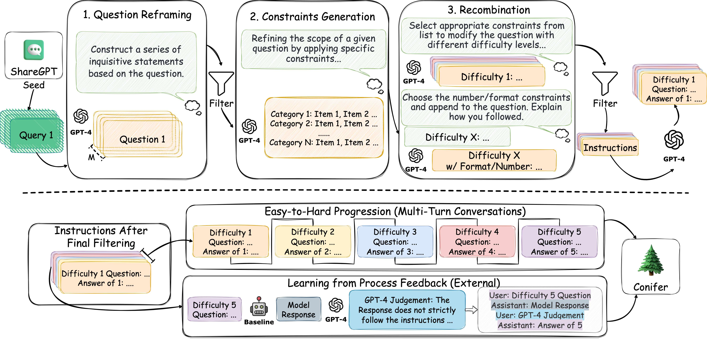

<h1 align="center">  Conifer: Improving Complex Constrained Instruction-Following Ability of Large Language Models </h1>

This repository contains the source code for reproducing the Conifer dataset.

<p align="center">
  🤗 <a href="https://huggingface.co/datasets/ConiferLM/Conifer">HF Repo</a>&nbsp;&nbsp;&nbsp;
  📄 <a href="https://arxiv.org/abs/2402.20000">Paper</a>&nbsp;&nbsp;&nbsp;
</p>


## Data

`conifer_data_samples/` contains some dummy instances of Conifer dataset with the instances of each steps. The full Conifer dataset is release on the HuggingFace 🤗: [Conifer](https://huggingface.co/datasets/ConiferLM/Conifer).

## Model 

We fine-tuned **Mistral-7B** and **LLaMA-2-13B** based on the combination of Conifer dataset and [ShareGPT-53k data](https://huggingface.co/datasets/anon8231489123/ShareGPT_Vicuna_unfiltered), using the [alignment-handbook](https://github.com/huggingface/alignment-handbook) and [FastChat](https://github.com/lm-sys/FastChat).  

##  Conifer Dataset Construction

<p align="center" width="100%">
<a ></a>
</p>

#### 0. Prepare the seed instruction. 
- We use the ShareGPT data as the initial seed instructions. This can be done by running the command `python 00_get_seed.py --input your_seed_file_path`. The script needs FastText models for language identification. You can get the model from [FastText Language identification](https://fasttext.cc/docs/en/language-identification.html).
- If you would like to use other data, simply compile them into a single .txt file with each line representing a seed instruction. The txt file should be named `selected_query.txt` and placed in the `./conifer_data` folder.

#### 1. Conifer Dataset Construction (without external process feedback)
- If you have the initial seed file in `./conifer_data/selected_query.txt`, set your `OPENAI_API_KEY` in the `conifer_produce.sh` and simply run bash `conifer_produce.sh`. Then, you can obtain the final Conifer-like dataset in `./conifer_data/06_answer.json` and `./conifer_data/06_answer_internal.json`, which represent the vanilla Conifer data and Conifer with internal process feedback, respectively.
- This process may take a long time since it makes numerous calls to the OPENAI API. You can manually increase the concurrency number by passing `--worker` after each python command in `conifer_produce.sh`; the default number is 4.
- To deal with connection errors which may interrupt the program, we have set the save interval to 2, meaning that after producing every 2 samples, the results will be saved in the `./conifer_data` directory. This interval can be manually adjusted using `--save-interval`.
- We also save the process results after each step, and you can easily find them in `./conifer_data` with the corresponding prefix number.

#### 2. Conifer with External Process Feedback
- You should first run step 2 before producing the external process feedback data.
- Begin by executing `python 07a_external_inference.py --model your_model_name` to obtain the inferior results of the instructions (the Difficulty 5 instructions obtained from step 2). The default model is `Mistral-7B-Instruct-v0.1`; you may change `--model` to obtain different results.
- After acquiring the inferior results, simply run `python 07b_external_feedback.py`, and you will then be able to find the external process feedback data in `./conifer_data/06_answer_external.json`.

#### 3. Conifer with Easy-to-Hard Progression
- You can use `utils.get_multi_turn(input, output)` to generate the easy-to-hard progression multi-turn data as mentioned in our paper. The input argument should be the path to `06_answer.json`, such as `./conifer_data/06_answer.json`; output is the path where you want the processed data to be saved. A output sample can be found at `./conifer_data/06_multi_turn.json`.

#### NOTE:
1. We provide examples of each step under `./conifer_data_samples`; the Conifer data you produce should be the same as the examples.
2. The target directory can be changed by using the `--dir` option in each step; the default is `conifer_data`.
3. Remember to check the intermediate results to ensure your money is not wasted.

## Training

We use the [alignment-handbook](https://github.com/huggingface/alignment-handbook) to train our Mistral-7B based models, and use the [FastChat](https://github.com/lm-sys/FastChat) to train our LLaMA-2-13B based models. You can find guidance from their respective github repos. 

## Evaluation

We have listed the evaluation benchmarks that we used in our paper. Except for IFEval, the other benchmarks utilize the GPT-4 API to obtain results. 

[IFEval](https://github.com/google-research/google-research/tree/master/instruction_following_eval)

[FollowBench](https://github.com/YJiangcm/FollowBench)

[InFoBench](https://github.com/qinyiwei/InfoBench)

[AlpacaEval](https://github.com/tatsu-lab/alpaca_eval)

[MT-Bench](https://github.com/lm-sys/FastChat/tree/main/fastchat/llm_judge)

## Performance

#### Supervised Fine-tuned (SFT) Models

|  -   | Final Stage | IFEval  | FollowBench Avg  | FollowBench Hard (L4-L5)  | InFoBench  | AlpacaEval LC Win Rate  | MT-Bench  |
|  :----  | :----  | :----  | :----  | :----  | :----  | :----  | :----  |
| Deita-7B-v1.0-SFT  | SFT | 45.1 | 42.0 | 31.6 | 78.6 | - | 7.22 |
| Evol-Instruct-7B-SFT  | SFT | 44.0 | 40.7 | 27.6 | 75.6 | 9.4% | 6.51 |
| ShareGPT-7B-SFT  | SFT | 43.3 | 42.9 | 32.3 | 78.5 | 11.6% | 6.86 |
| Conifer-7B-SFT  |SFT | 50.8 | 44.9 | 35.7 | 79.5 | 12.5% | 7.08 |


#### DPO/RLHF Models

|  -   | Final Stage | IFEval  | FollowBench Avg  | FollowBench Hard (L4-L5)  | InFoBench  | AlpacaEval LC Win Rate  | MT-Bench  |
|  ----  | ----  | ----  | ----  | ----  | ----  | ----  | ----  |
| LLaMA-2-70B-Chat  | RLHF | - | 47.5 | 39.0 | 84.4 | 14.7% | 6.86 |
| Zephyr-7B-beta  | DPO | 44.9 | 44.8 | 36.4 | 78.0 | 13.2% | 7.34 |
| Deita-7B-v1.0  | DPO | 51.9 | 45.7 | 38.5 | 80.9 | 16.1% | 7.55 |
| ShareGPT-7B-DPO  | DPO| 48.2 | 47.7 | 38.9 | 82.0 | 15.1% | 7.10 |
| Conifer-7B-DPO  |DPO| 52.3 | 50.0 | 44.1 | 82.3 | 17.7% | 7.25 |

## Citation

If you find the content of this project helpful, please cite our paper as follows:

```bibtex
@article{
  sun2024conifer,
  title={Conifer: Improving Complex Constrained Instruction-Following Ability of Large Language Models},
  author={Haoran Sun and Lixin Liu and Junjie Li and Fengyu Wang and Baohua Dong and Ran Lin and Ruohui Huang},
  journal={arxiv preprint arXiv:},
  year={2024},
  url={}
}
```
